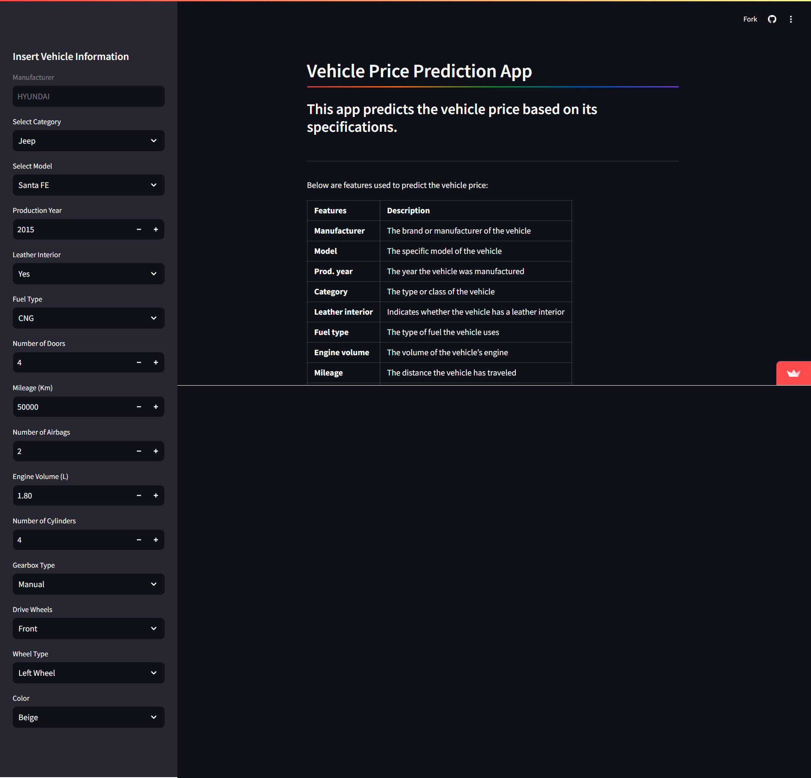

# 🚗 Car Price Predictor - Predictive Vehicle Pricing Model

## 🏷 Project Title: Vehicle Price Prediction Model - DevSpark Team

This project is part of the "Fundamentals of Data Mining" module, aiming to build a predictive model that estimates vehicle prices using historical data. Team DevSpark will focus on various attributes such as make, model, year, and mileage to deliver accurate price predictions.

---

## 📑 Table of Contents

- 📖 [Background](#1-background)
- 🔍 [Scope of Work](#2-scope-of-work)
- 📋 [Project Plan and Timeline](#3-project-plan-and-timeline)
- 💡 [Assumptions](#4-project-assumptions)
- 👥 [Roles and Responsibilities](#5-roles-and-responsibilities)
- 📦 [Deliverables](#6-deliverables)
- 🖥️ [Technology Stack](#7-technology-stack)
- 🚀 [How to Run the Project](#8-run-app)
- ✨ [Future Improvements](#9-future-improvements)

---

## 1. 📖 Background

With advancements in technology, the automotive industry has experienced a surge in demand for personalized vehicles. This project aims to develop a predictive model using historical data to estimate vehicle prices, helping car dealerships, buyers, and sellers make informed decisions.

---

## 2. 🔍 Scope of Work

### 🛠 Data Wrangling and Cleansing Layer  
- Cleaning and preparing the dataset to remove irrelevant information and transform it for further analysis.

### 🧠 Model Building Layer  
- Training predictive models to estimate prices based on various vehicle attributes.

### 🔎 Data Mining Layer  
- Uncovering hidden patterns within the dataset to extract valuable insights.

### 📊 Data Visualization Layer  
- Providing clear and user-friendly visual representations of data to showcase findings.

### 🖥 User-Interface Layer  
- Developing an interactive Streamlit application where users can explore data insights and make price predictions.
  
  _*Below is an image of the Streamlit app interface used to interact with the model and explore results visually.*_


---

## 3. 📋 Project Plan and Timeline

1. 🧐 **Problem Definition**
2. 🎯 **Identification of Business Goals**
3. 🧩 **Data Mining Functionality**
4. 🗂 **Data Selection and Preparation**
5. 🏗 **Model Building and Evaluation**
6. 🚀 **Deployment of the Model and Client Application**
7. 📝 **Documentation and Demonstration**

---

## 4. 💡 Project Assumptions

- 💵 Predicted prices do not include taxes or shipment fees.
- 🌍 Prices are in USD.

---

## 5. 👥 Roles and Responsibilities

Each team member will be involved in various phases such as data collection, preprocessing, model building, and UI development.

- **💻 Data Collection & Preprocessing**: Responsible for gathering and cleaning the dataset.
- **🧠 Model Development**: Focused on building and fine-tuning predictive models.
- **📊 Data Visualization**: Creating easy-to-understand charts and graphs.
- **🖥 UI Development**: Designing an interactive web application for users.

---

## 6. 📦 Deliverables

- ✅ A predictive model integrated with an interactive client application.

---

## 7. 🖥️ Technology Stack

- **Programming Languages:** Python
- **Libraries/Frameworks:**
  - **Pandas & NumPy**: For data wrangling and analysis
  - **Scikit-learn**: For model building and evaluation
  - **Matplotlib & Seaborn**: For data visualization
  - **Streamlit**: For creating the interactive web app
- **Deployment Environment:** Streamlit Cloud or similar
- **Version Control:** GitHub for collaborative code management

---

## 🚀 How to Run the Project

1. **Clone the repository:**
   ```bash
   git clone https://github.com/Hansamalee0630/DevSpark-Car.git
   
2. **Navigate to the project directory:**
   ```bash
   cd car-price-predictor

3. **Install the required libraries:**
   ```bash
   pip install -r requirements.txt

3. **Run the Streamlit app:**
   ```bash
   streamlit run app.py

## 9. ✨ Roles and Responsibilities

- Enhancing the model accuracy with more advanced algorithms like XGBoost or LightGBM.
- Adding more vehicle attributes like fuel type, transmission, and location to improve predictions.


### Additional Notes:
1. You can replace `https://github.com/Hansamalee0630/DevSpark-Car.git` with the actual repository URL.
2. Make sure to add a `requirements.txt` file listing all the necessary libraries for the project (e.g., `pandas`, `scikit-learn`, `streamlit`).
3. Ensure the `app.py` file is present and correctly sets up the Streamlit application.

You can commit this `README.md` file to your repository and use it as the project overview!
